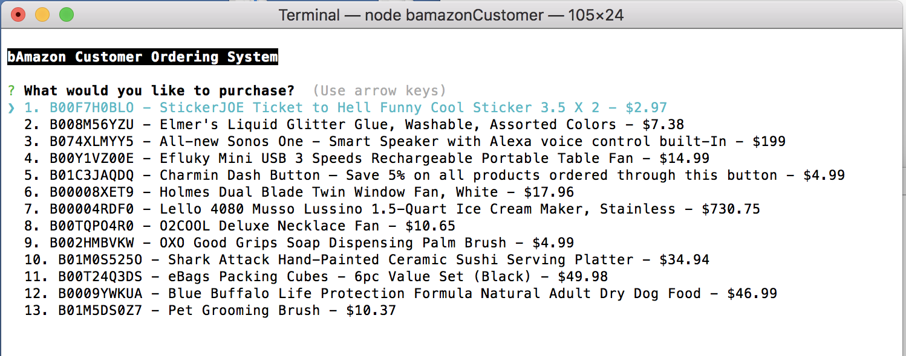
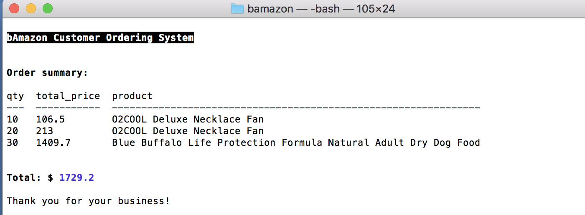
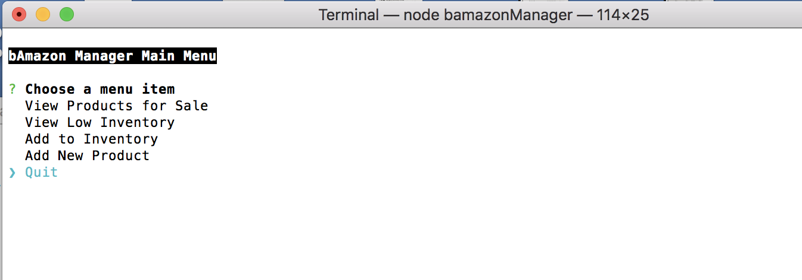
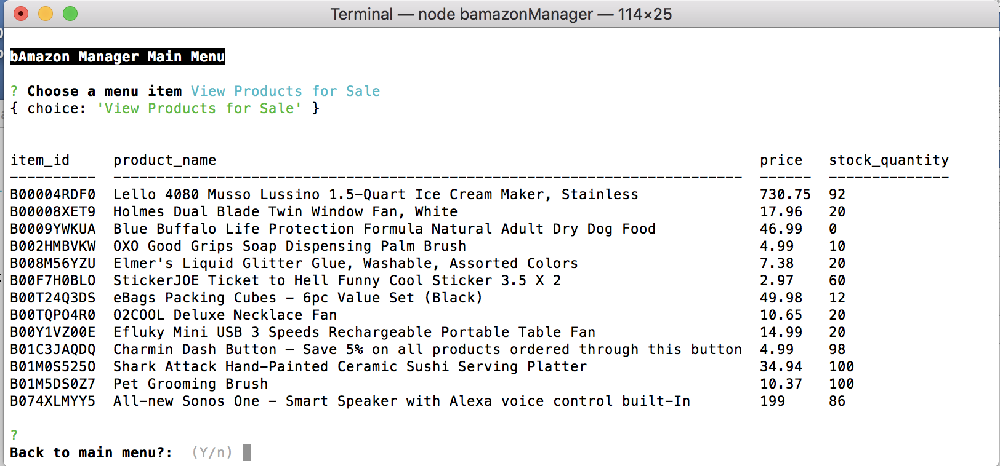
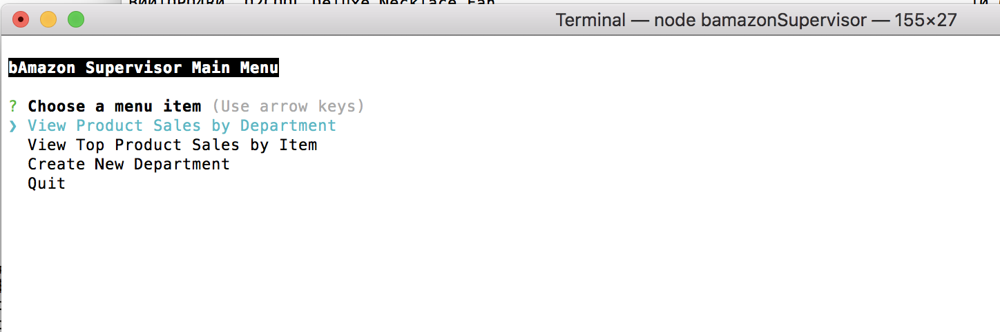
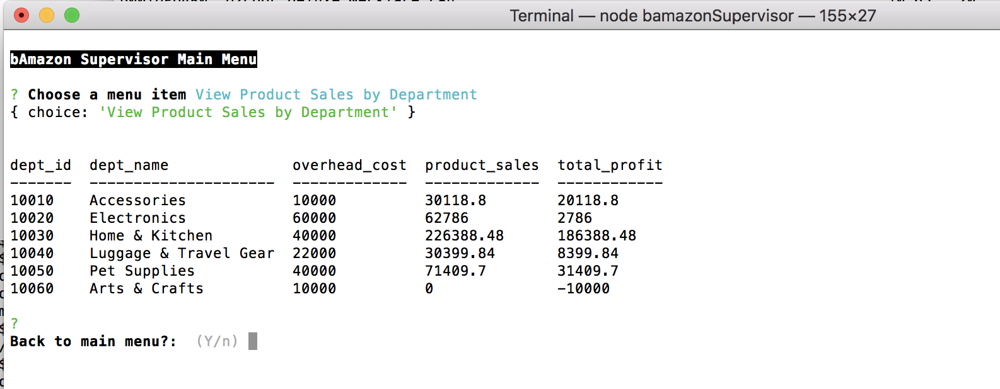

# bamazon

This is a node.js/MySQL Amazon-like storefront application that takes into consideration 3 perspectives - Customer view, Manager view and Supervisor view.

## Description 

The application utilizes a centralized MySQL database which houses product data, inventory and sales figures.  From the customer point of view, they can order items and see a total bill.  From the manager perspective, they can control inventory.  From the supervisor perspective, they can control department level information.

### Usage instructions

Users will interact will invoke specific node applications based on their role:

    * `node bamazonCustomer` - Customer
    * `node bamazonManager`- Manager
    * `node bamazonSupervisor` - Supervisor

In this screenshot, the customer is shown all the products and can arrow up and down to select one to purchase.

Once all of they've completed their purchases, the application will show a total bill.

This screenshot shows the manager menu options which allow them to manage inventory by adding inventory and new products.

This example shows the full listing of products for sale, their prices and current inventory.

This screenshot shows the supervisor menu options which provides choices that pertain to overall departments and sales.

This screenshot is an example of the revenue by product.
